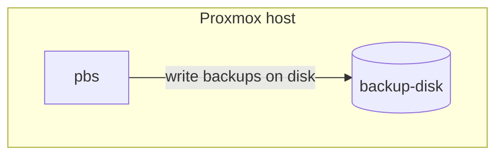

# Backups management

Backups are managed at the infrastructure level using [pbs](https://www.proxmox.com/en/products/proxmox-backup-server/overview) and a pool based backup job



## Backup synchronization

Backups are also saved in a remote Hetzner storagebox, that is synchronized using `rsync` in a cron job

```bash
# backup rsync to storagebox and send mail with report of the sync
0 22 * * * rsync --exclude "lost+found" -Pavr --delete "/mnt/datastore" "storagebox:" >  /var/log/backup-sync-"$(date +%s)".log
```
