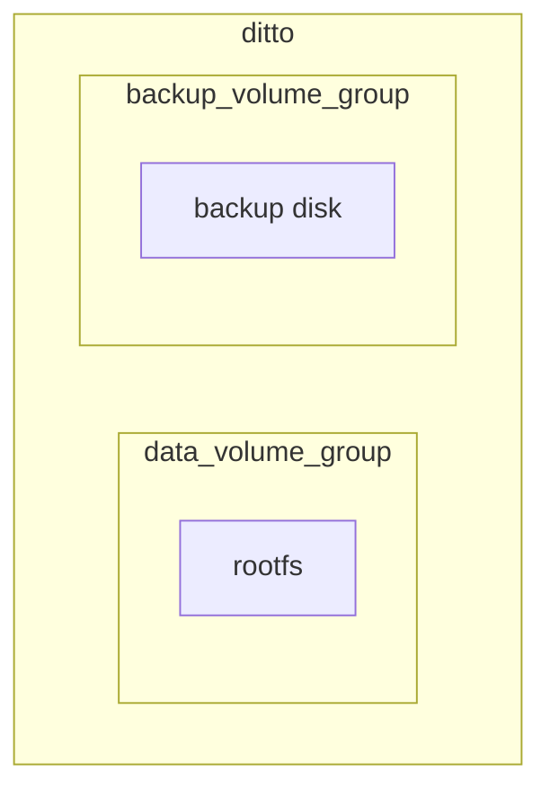
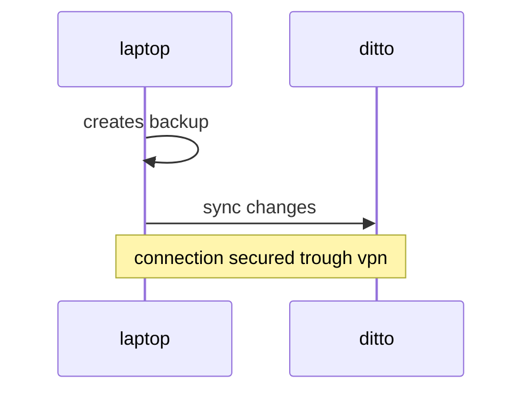

# Backups management

This infrastructure manages all of my backups, the backup centralizer is an lxc container that runs [pbs](https://www.proxmox.com/en/products/proxmox-backup-server/overview)

All of my personal pc use borg for managing backup locally and then copy content to the centralizer machine using rsync, backup is achieved trough a [script](https://github.com/carnivuth/scripts/blob/main/bin/backup.sh) that runs as a systemd timer

vms and containers backups are managed trough proxmox backup server installed on the centralizer
