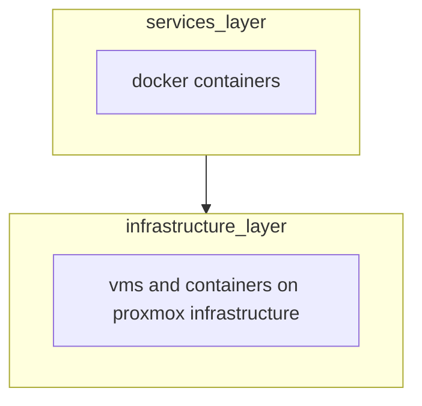
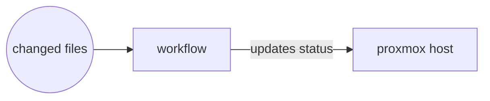

# Concepts

The Infrastructure is divided in 2 logical layers

- **infrastructure** layer, with some system services like DNS and email notifications
- **services** layer that includes services deployed on docker containers

The relation between the 2 layer is top/bottom



##  workflows

The synchronization procedures between a `git push` and an update of the infrastructure and services state is called **workflow**, a workflow it's responsible for maintaining the state of the proxmox cluster based on what's in the repository.

A workflow is executed when a change in the repository is detected using a git hook on the merge event, each workflow gets the list of modified files in the repository as input and change the status accordingly:



### Execution

The execution of a workflow is performed by the middleware scripts that loops each workflow, check if a given workflow need to be executed and runs the actual workflow

### Structure

Workflows need to have a specific structure in order to be executed by the middleware:

```bash
function workflow_regex(){
# this function outputs a grep regex that matches the files for which this workflow should be executed
}

function workflow(){
# operation to perform when a file changes, $1 is the list of changed files
}
```
