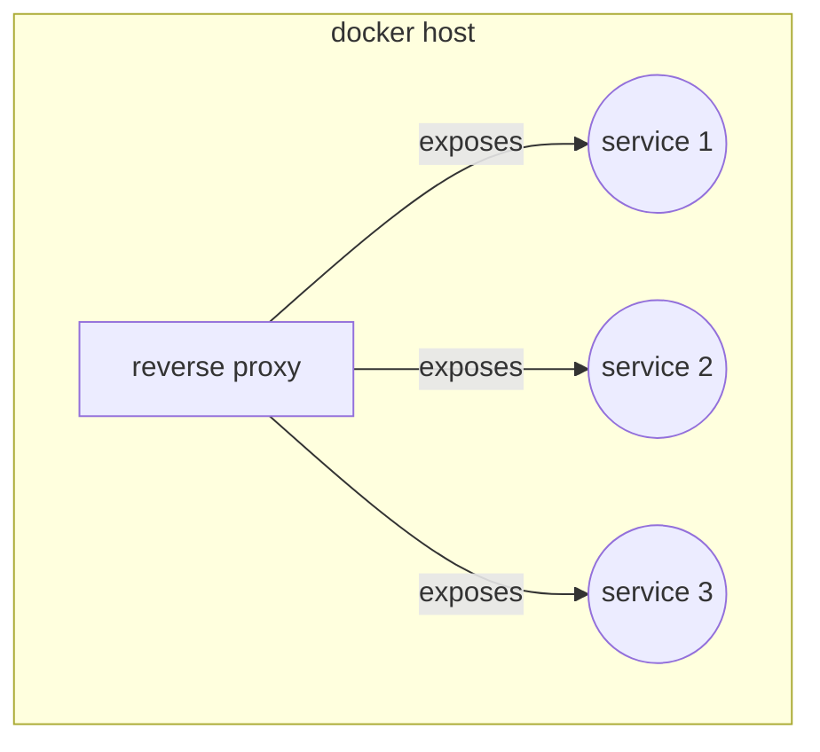

# Personal cloud services management

The project is used to manage my personal cloud services using `docker` containers, all services are hosted inside a vm managed trough the infrastructure layer.



## Add a new service

Services are installed using a playbook and `docker compose` configuration file,  to add a service create a file as `service_name/docker-compose.yml` inside `services/files/` directory

### Configure web interface

To configure web interface, add the reverse proxy network as an external network

```yaml
networks:
  services:
    name: services
    external: true
```

Then add `traefik` and `homepage labels` for reverse proxy configuration and homepage icon (*replace service with the service name*)

```yaml
    labels:
      - "traefik.enable=true"
      - "traefik.http.routers.service.rule=Host(`${HOST}`)"
      - "traefik.http.services.service.loadbalancer.server.port=25600"
      - "traefik.http.routers.service.entrypoints=websecure"
      - "traefik.http.routers.service.tls=true"
      - "traefik.http.routers.service.tls.certresolver=myresolver"
      - "homepage.group=service group"
      - "homepage.name=Komga"
      - "homepage.icon=service.svg"
      - "homepage.href=https://${HOST}"
      - "homepage.description=Service description"
```

### Adding configuration files

Configuration files are managed inside the `etc/` directory and copied over when provisioning, when adding a service that needs configuration files create a dir `etc/` inside the service folder and edit the parameters as needed, see homepage service as reference
