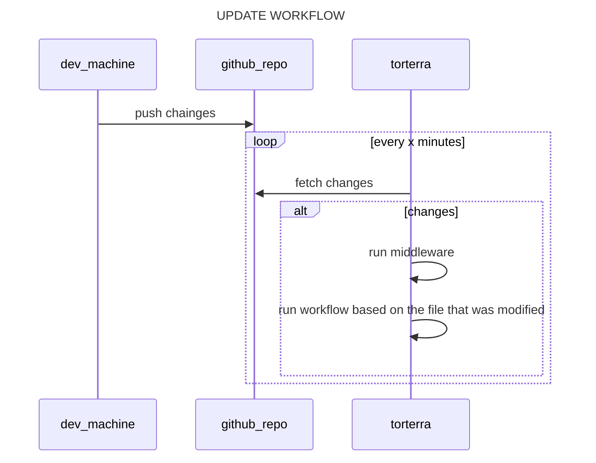

# Installation

Installation of the repository is done by cloning it inside the proxmox host and making an initial setup to allow the continous integration pipeline to trigger itself when commits are made to the main branch

- clone repository inside the proxmox host

```bash
git clone https://github.com/carnivuth/labcraft /usr/local/labcraft
```

- create a python virtual environment to run ansible inside and install ansible roles and collections

```bash
cd /usr/local/labcraft
python -m venv env
source env/bin/activate
pip install -r requirements.txt
ansible-galaxy collection install -r collections/requirements.yml
ansible-galaxy role install -r roles/requirements.yml
```

- add secrets folowing this [guide](#HANDLE%20SECRETS)

- create terraform vars file following the vars declaration in `terraform/variables.tf`

- create a proxmox admin token for terraform

- create templates for vms and containers

- install terraform

```bash
apt install terraform
```

- run terraform to deploy vms

```bash
cd terraform && terraform init && terraform plan -o /tmp/plan && terraform apply /tmp/plan
```

### Handle secrets

Sensitive variables are stored inside encrypted vault files managed with `ansible-vault`, in order to create it do the following:

- create a sample with the following command:

```bash
grep -ho -e 'vault_[a-z_]*' $(find infrastructure/ -name '*.yml' | grep -v vault.yml) > infrastructure/vault.yml
grep -ho -e 'vault_[a-z_]*' $(find services/ -name '*.yml' | grep -v vault.yml) > services/vault.yml
```

- create a file to store the vault password

```bash
pwgen -N 1 64 > services/passfile && chmod 600 services/passfile
pwgen -N 1 64 > infrastructure/passfile && chmod 600 infrastructure/passfile
```

- set vault pass file in `ansible.cfg`

```bash
echo -e '[defaults]\n host_key_checking = False \n vault_password_file=/usr/local/labcraft/services/passfile' > services/ansible.cfg
echo -e '[defaults]\n host_key_checking = False \n vault_password_file=/usr/local/labcraft/infrastructure/passfile' > infrastructure/ansible.cfg
```

- add variables and encrypt the file with ansible vault

```bash
cd /usr/local/labcraft/services
ansible-vault encrypt vault.yml
cd /usr/local/labcraft/infrastructure
ansible-vault encrypt vault.yml
```

- move the file to the `group_vars` folder

```bash
mv sample.yml playbooks/group_vars/all/vault.yml
```

### Update management and provision

To avoid having to run ansible manually every time there is an update do the following

- add the `scripts/update_labcraft.sh` to cron:

```cron
# path variable is needed
PATH=/usr/local/labcraft/env/bin:/usr/local/sbin:/usr/local/bin:/usr/sbin:/usr/bin:/sbin:/bin
* * * * * /usr/local/labcraft/update_labcraft.sh > /dev/null 2>&1
```

Then link `workflows/middleware.sh` to the git hooks dir (*more on the topic [here](https://carnivuth.github.io/TIL/pages/git_github/GIT_HOOKS)*) as follows

```bash
cd .git/hooks
ln -fs ../../workflows/middleware.sh post-merge
```

So every time a commit is pushed to remote cron will pull the updates from remote repo and the git hook will run the correct workflow based on the file that was modified


