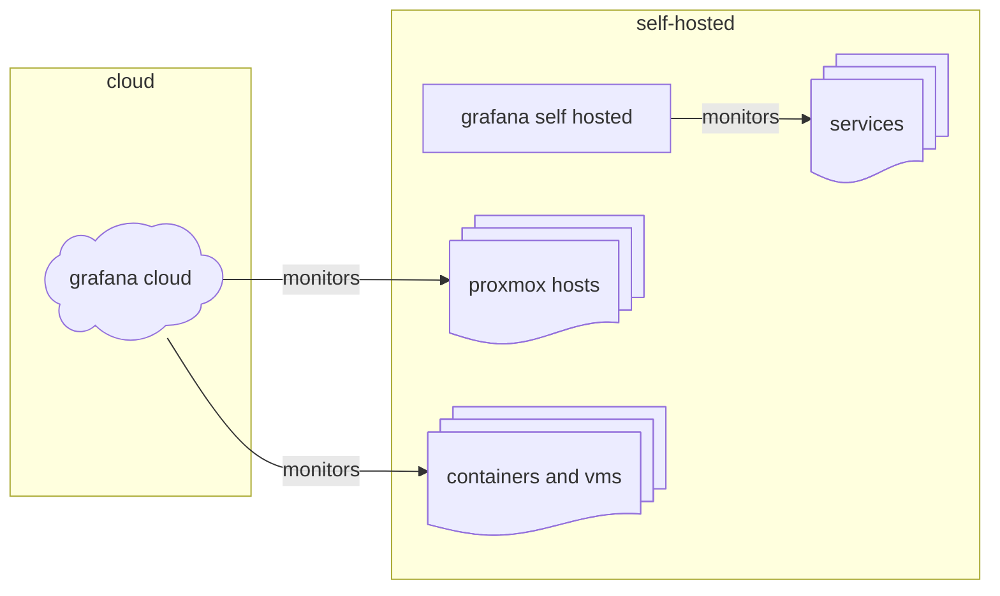

# Monitoring

Monitoring is done using [grafana](https://grafana.com/) (*both self hosted and cloud*) at 2 different levels:

- infrastructure level: monitors infrastructural components like proxmox hosts status, machine and vms
- service monitoring: monitors personal services information

