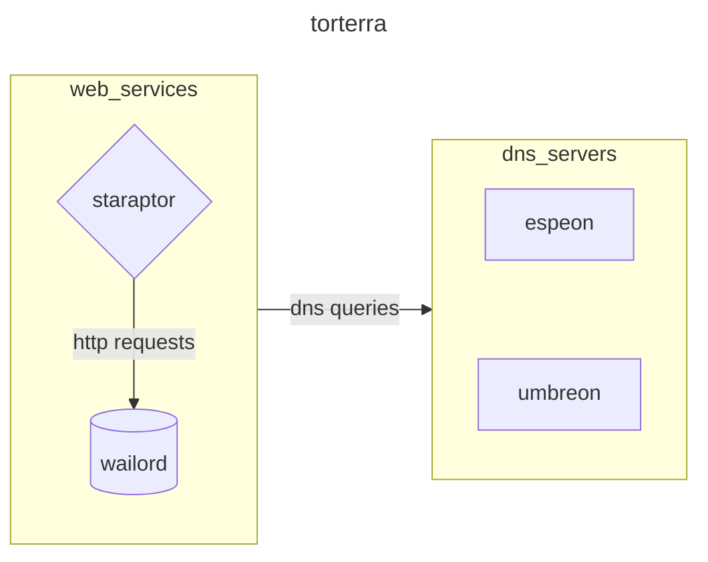
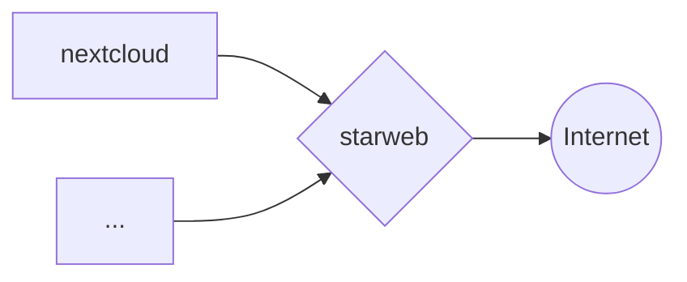
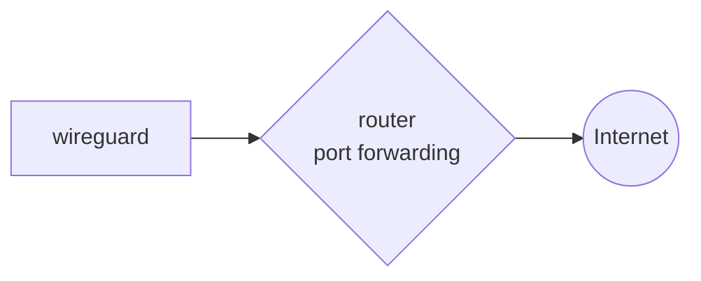
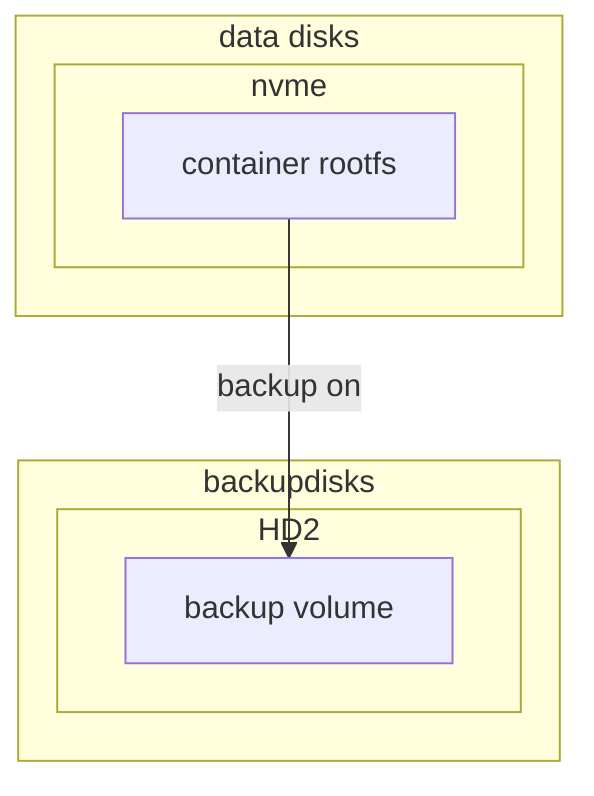

# LABCRAFT

Files for homelab provisioning and maintenance operations of my personal proxmox cluster for self-hosted services, application deployment environment and playhouse :)

## ARCHITECTURE


The machine runs proxmox cluster with vms. The main purpose of the server is to expose web interfaces of docker containers for some services that i use every day



## NETWORKING

some services are exposed to the internet via HTTPS reverse proxy with nginx



some other services are exposed through port forwarding on the router



## DISKS MANAGEMENT

Containers and virtual machines's rootfs disk is located in the `local-lvm` volume on the nvme disk. all the volumes are backuped in the other hard drive from pbs



## BACKUPS

Backups are made with the use of PBS in snapshot mode, every night at 21:00 for all containers and virtual machines, one of the 2 hard drives is dedicated to this purpose

## INSTALLATION

- clone repository

```bash
git clone https://github.com/carnivuth/labcraft
```

- create venv and install dependencies

```bash
cd labcraft
python -m venv env
source env/bin/activate
pip install -r requirements.txt
```

- install ansible collections and roles

```bash
source env/bin/activate
ansible-galaxy collection install -r collections/requirements.yml
ansible-galaxy role install -r roles/requirements.yml
```

- create inventory following the template in `inventory/inventory.proxmox.yml`

```bash
cp inventory/inventory.proxmox.yml inventory/inventory.proxmox.yml
```

- create vars file following the template in `vars/sample.yml`

```bash
cp playbooks/vars/sample.yml playbooks/vars/prod.yml
```

- create terraform vars file following the vars declaration in `terraform/variables.tf`

- create a proxmox admin token for terraform

- create templates for vms and containers following [this](https://carnivuth.github.io/TIL/pages/CREATE_VM_TEMPLATE)

- run terraform to deploy vms and add one of the dns servers to `/etc/hosts`

- run preflight playbook for provisioning

```bash
ansible-playbook -i inventory/prod.proxmox.yml carnivuth.labcraft.preflight
```

### UPDATE MANAGEMENT

To avoid having to run ansible manually every time there is an update do the following

- add a cronjob to do git pull periodically as an example:

```bash
#!/bin/bash
NTFY_ADDRESS=address
cd /usr/local/labcraft
if ! git pull | grep -E 'Already up to date.'; then
        curl $NTFY_ADDRESS -d "updated labcraft repo";
fi
```

- and add the following chronjob

```cron
* * * * * /usr/local/bin/update_labcraft.sh > /dev/null 2>&1
```

Then setup a git hook (*more on the topic [here](https://carnivuth.github.io/TIL/pages/git_github/GIT_HOOKS)*) as follows

```bash
#!/bin/bash
# Redirect output to stderr.
exec 1>&2
# check if last commit contains something that has notes in the name
INCLUDED=playbooks
LOG_DIR="/var/log/ansible"; if [[ ! -d "$LOG_DIR" ]];then mkdir -p "$LOG_DIR"; fi

if git diff --name-only HEAD HEAD~1 | grep "$INCLUDED"; then
        # do something
        source env/bin/activate
        ansible-playbook -i inventory/prod.proxmox.yaml -e 'vars_file=prod' playbooks/common.yml > "$LOG_DIR/common.log"
else
        echo "no $INCLUDED modified, nothing to do"
fi
```

So every time a commit is pushed to remote cron will pull the repo and the hook will run ansible
