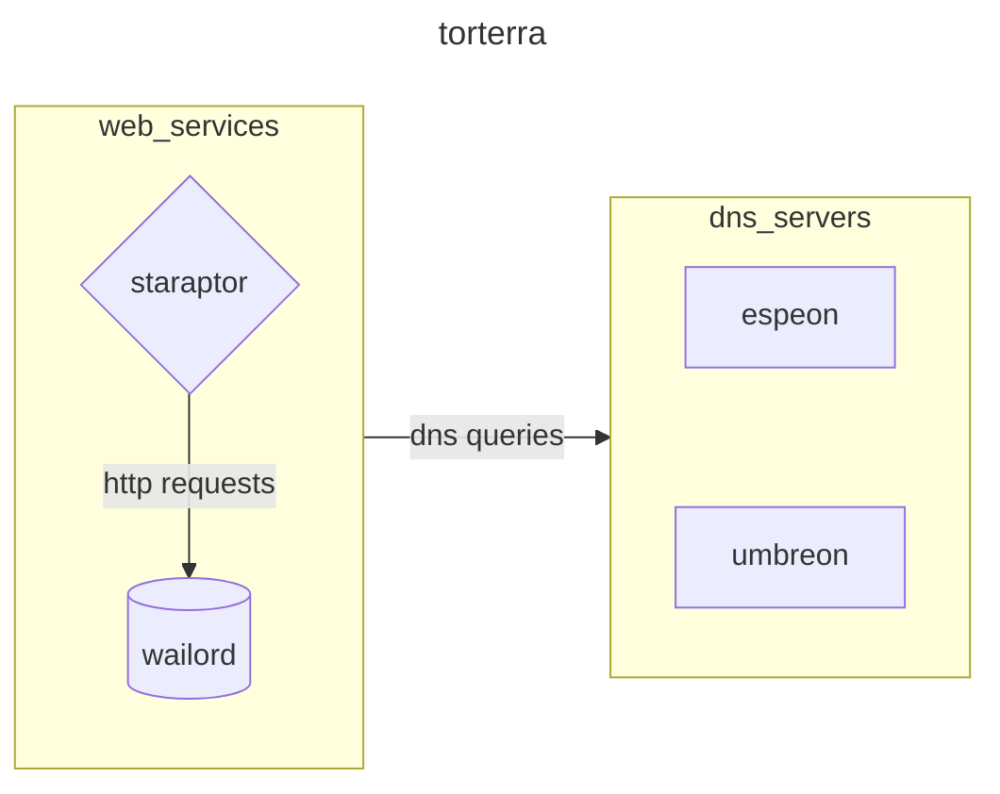
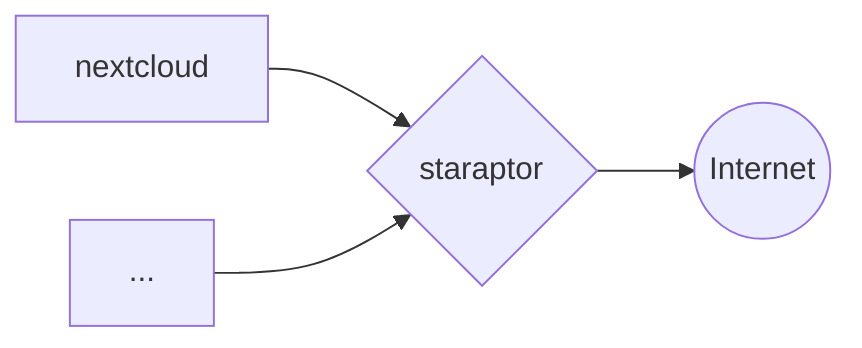
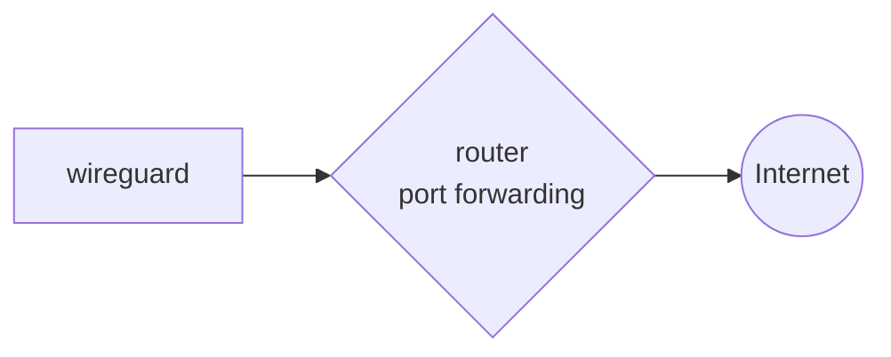
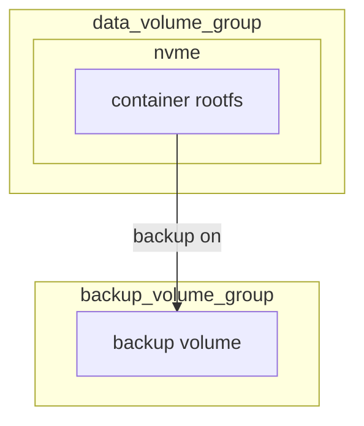
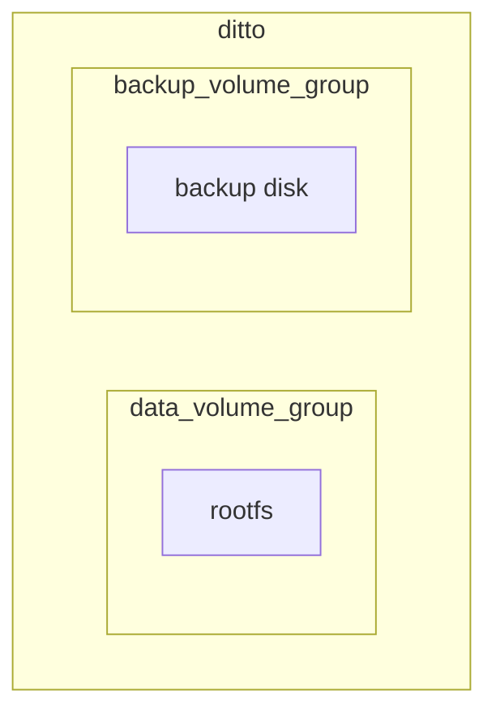
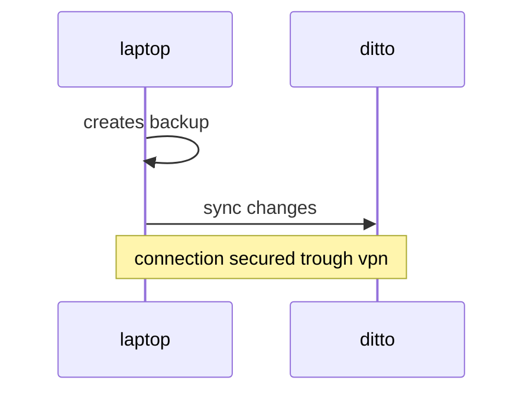
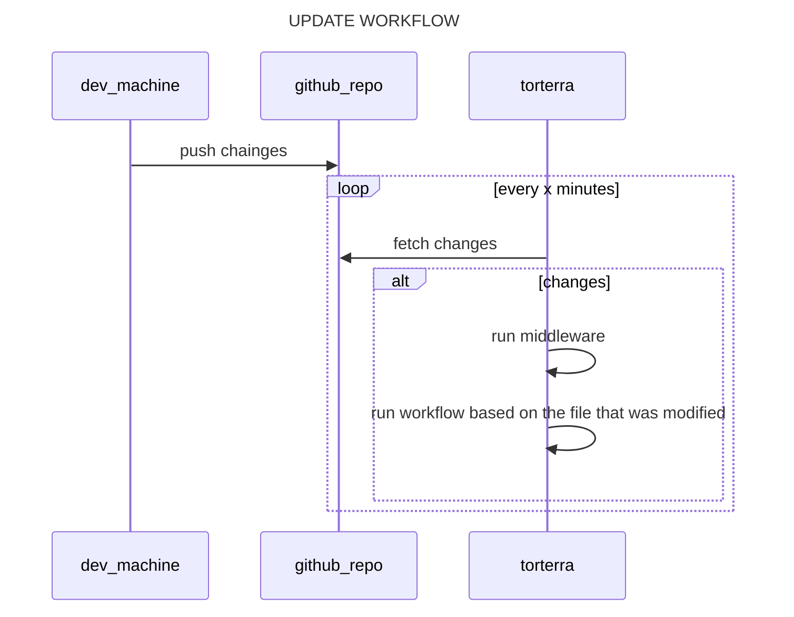

# Labcraft

Files for homelab provisioning and maintenance operations of my personal proxmox cluster for self-hosted services, application deployment environment and playhouse :)

## ARCHITECTURE

The main purpose of the server is to expose web interfaces of docker containers for some services that i use every day



## Networking

Some services are exposed to the internet via `HTTPS` reverse proxy implemented with `nginx`



Some other services are exposed through port forwarding on the router



****
## Storage

The proxmox host has a bunch of disks installed and all of them are managed trough lvm, one of them is an nvme that manages volumes for vms and containers the others are for backing up data,



## Backups management

This infrastructure manages all of my backups, the backup centralizer is an lxc container that runs [pbs](https://www.proxmox.com/en/products/proxmox-backup-server/overview)



All of my personal pc use borg for managing backup locally and then copy content to the centralizer machine using rsync, backup is achieved trough a [script](https://github.com/carnivuth/scripts/blob/main/bin/backup.sh) that runs as a systemd timer



vms and containers backups are managed trough proxmox backup server installed on the centralizer

proxmox host backups are done trough the use of borg and a cronjob script, after running the `configure_proxmox.yml` playbook configure ssh authentication to storage box

## INSTALLATION

- clone repository inside the proxmox host

```bash
cd /usr/local
git clone https://github.com/carnivuth/labcraft
```

- create venv and install dependencies

```bash
cd labcraft
python -m venv env
source env/bin/activate
pip install -r requirements.txt
```

- install ansible collections and roles

```bash
source env/bin/activate
ansible-galaxy collection install -r collections/requirements.yml
ansible-galaxy role install -r roles/requirements.yml
```

- add secrets folowing this [guide](readme.md#HANDLE%20SECRETS)
- create terraform vars file following the vars declaration in `terraform/variables.tf`

- create a proxmox admin token for terraform

- create templates for vms and containers following [this](https://carnivuth.github.io/TIL/pages/CREATE_VM_TEMPLATE)

- run terraform to deploy vms and add one of the dns servers to `/etc/hosts`

- run preflight playbook for provisioning

```bash
ansible-playbook -i inventory/prod.proxmox.yml carnivuth.labcraft.preflight
```

### HANDLE SECRETS

Sensitive informations are stored inside an encrypted vault file generated with `ansible-vault`, in order to create it do the following:

- create a  sample with the following command:

```bash
grep -e 'vault_[a-z_]*' playbooks/group_vars/all/vars.yml inventory/inventory.proxmox.yml  -ho > sample.yml
```

- create a file to store the vault password

```bash
pwgen -N 1 64 > passfile && chmod 600 passfile
```

- set vault pass file in `ansible.cfg`

```bash
[defaults]
host_key_checking = False
vault_password_file=/usr/local/labcraft/passfile
```

- add variables and encrypt the file with ansible vault

```bash
ansible-vault encrypt sample.yml
```

- move the file to the `group_vars` folder

```bash
mv sample.yml playbooks/group_vars/all/vault.yml
```

### UPDATE MANAGEMENT AND PROVISION

To avoid having to run ansible manually every time there is an update do the following

- add the `scripts/update_labcraft.sh` to cron:

```cron
* * * * * /usr/local/labcraft/update_labcraft.sh > /dev/null 2>&1
```

Then link `workflows/middleware.sh` to the git hooks dir (*more on the topic [here](https://carnivuth.github.io/TIL/pages/git_github/GIT_HOOKS)*) as follows

```bash
cd .git/hooks
ln -fs ../../workflows/middleware.sh post-merge
```

So every time a commit is pushed to remote cron will pull the updates from remote repo and the git hook will run the correct workflow based on the file that was modified


