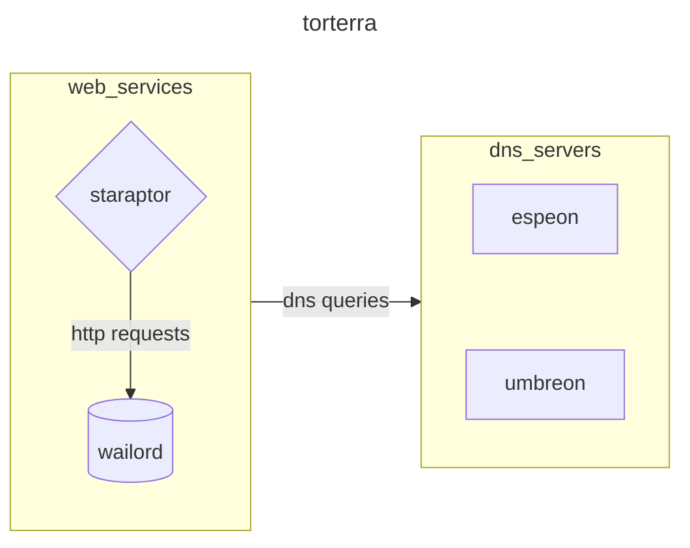
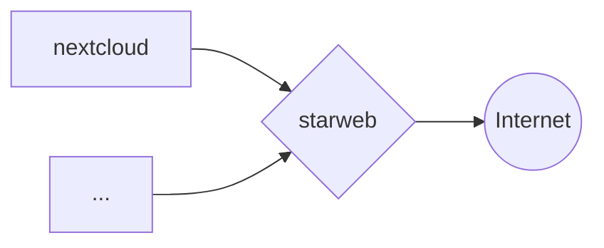
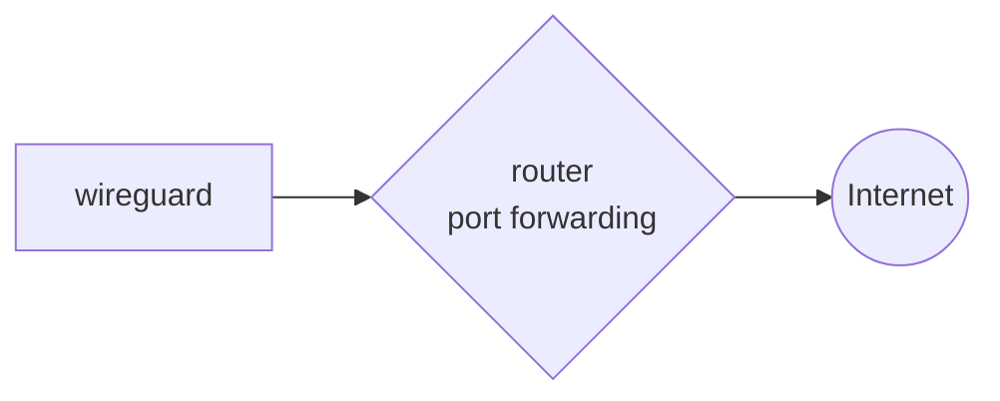
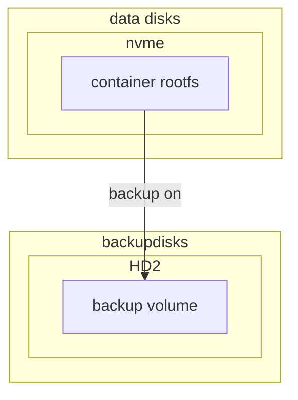
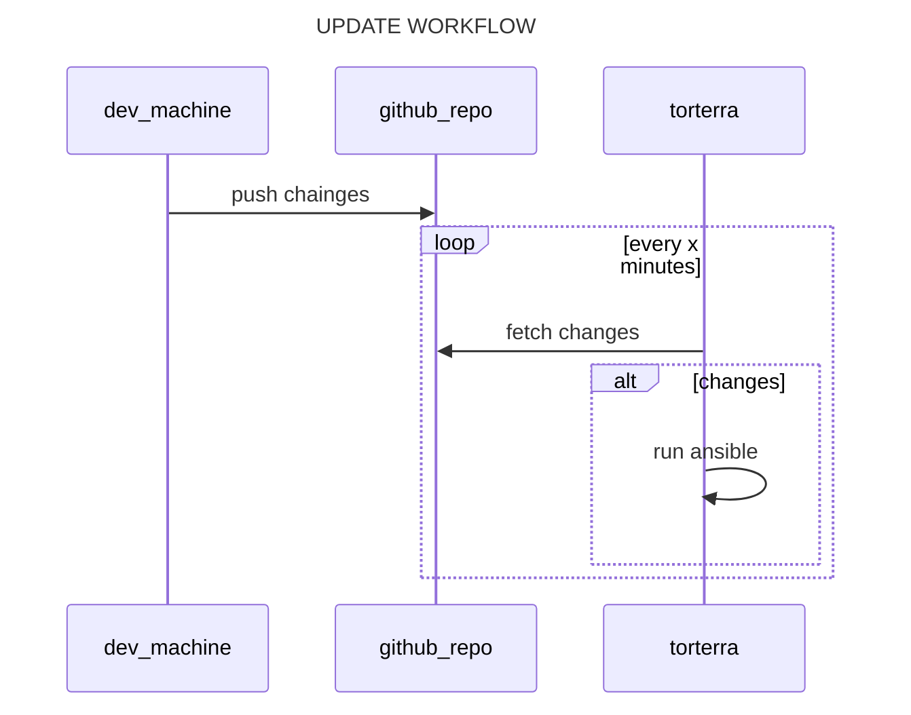

# LABCRAFT

Files for homelab provisioning and maintenance operations of my personal proxmox cluster for self-hosted services, application deployment environment and playhouse :)

## ARCHITECTURE


The machine runs proxmox cluster with vms. The main purpose of the server is to expose web interfaces of docker containers for some services that i use every day



## NETWORKING

some services are exposed to the internet via HTTPS reverse proxy with nginx



some other services are exposed through port forwarding on the router



## DISKS MANAGEMENT

Containers and virtual machines's rootfs disk is located in the `local-lvm` volume on the nvme disk. all the volumes are backuped in the other hard drive from pbs



## BACKUPS

Backups are made with the use of PBS in snapshot mode, every night at 21:00 for all containers and virtual machines, one of the 2 hard drives is dedicated to this purpose

## INSTALLATION

- clone repository

```bash
git clone https://github.com/carnivuth/labcraft
```

- create venv and install dependencies

```bash
cd labcraft
python -m venv env
source env/bin/activate
pip install -r requirements.txt
```

- install ansible collections and roles

```bash
source env/bin/activate
ansible-galaxy collection install -r collections/requirements.yml
ansible-galaxy role install -r roles/requirements.yml
```

- create inventory following the template in `inventory/inventory.proxmox.yml`

```bash
cp inventory/inventory.proxmox.yml inventory/inventory.proxmox.yml
```

- create vars file following the template in `vars/sample.yml`

```bash
cp playbooks/vars/sample.yml playbooks/vars/prod.yml
```

- create terraform vars file following the vars declaration in `terraform/variables.tf`

- create a proxmox admin token for terraform

- create templates for vms and containers following [this](https://carnivuth.github.io/TIL/pages/CREATE_VM_TEMPLATE)

- run terraform to deploy vms and add one of the dns servers to `/etc/hosts`

- run preflight playbook for provisioning

```bash
ansible-playbook -i inventory/prod.proxmox.yml carnivuth.labcraft.preflight
```

### HANDLE SECRETS

Sensitive informations are stored inside an encrypted vault file generated with `ansible-vault`, in order to create it do the following:

- create a  sample with the following command:

```bash
grep vault_ playbooks/group_vars/all/vars.yml inventory/inventory.proxmox.yml  -h | awk -F' ' '{print $3":"}' > sample.yml
```

- create a file to store the vault password

```bash
pwgen -N 1 64 > passfile && chmod 600 passfile
```

- set vault pass file in `ansible.cfg`

```bash
[defaults]
host_key_checking = False
vault_password_file=/usr/local/labcraft/passfile
```

- add variables and encrypt the file with ansible vault

```bash
ansible-vault encrypt sample.yml
```

- move the file to the `group_vars` folder

```bash
mv sample.yml playbooks/group_vars/all/vault.yml
```

### UPDATE MANAGEMENT

To avoid having to run ansible manually every time there is an update do the following

- add the `scripts/update_labcraft.sh` to cron:

```cron
* * * * * /usr/local/labcraft/update_labcraft.sh > /dev/null 2>&1
```

Then link `scripts/post-merge` to the git hooks dir (*more on the topic [here](https://carnivuth.github.io/TIL/pages/git_github/GIT_HOOKS)*) as follows

```bash
cd .git/hooks
ln -fs ../../scripts/post-merge post-merge
```

So every time a commit is pushed to remote cron will pull the repo and the hook will run ansible


