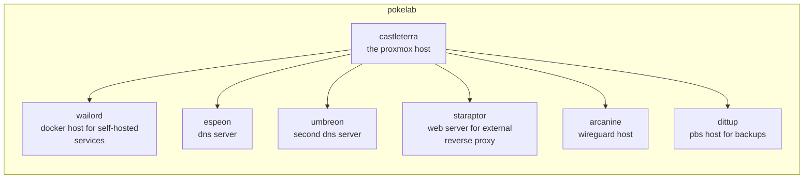
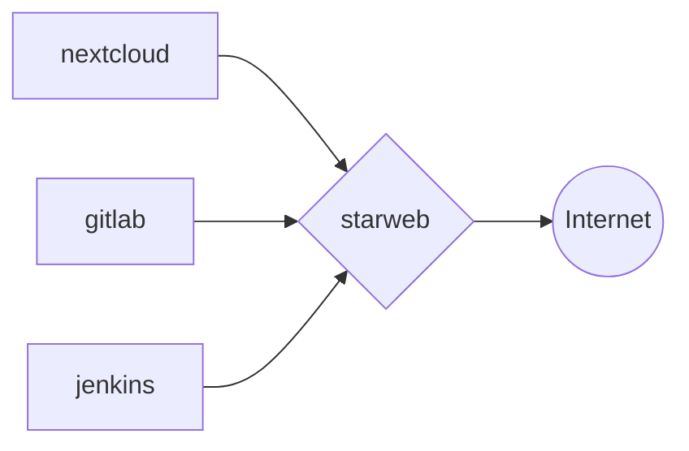
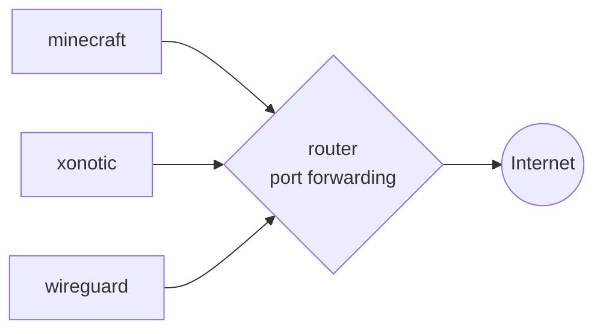
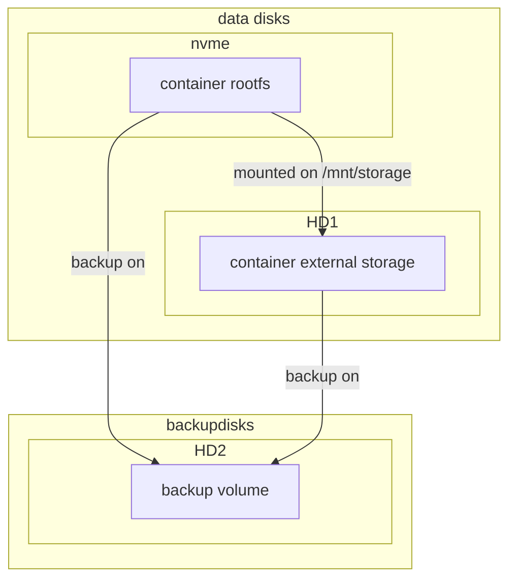

# LABCRAFT

Files for homelab provisioning and maintenance operations of my personal proxmox cluster for self-hosted services, application deployment environment and playhouse :)

## ARCHITECTURE

The machine runs proxmox cluster with vm's and container above it



## NETWORKING

some services are exposed to the internet via HTTPS reverse proxy with nginx



some other services are exposed through port forwarding on the router



## DISKS MANAGEMENT

Containers and virtual machines's rootfs disk is located in the `local-lvm` volume on the nvme disk. all the volumes are backuped in the other hard drive from pbs



## BACKUPS

Backups are made with the use of PBS in snapshot mode, every night at 21:00 for all containers and virtual machines, one of the 2 hard drives is dedicated to this purpose, only the last 5 backups are maintained

for big containers stop mode is used instead, see [this](https://pve.proxmox.com/wiki/Backup_and_Restore#_backup_modes) for reference

## INSTALLATION

- clone repository

```bash
git clone https://github.com/carnivuth/labcraft
```

- create venv and install dependencies

```bash
cd labcraft
python -m venv env
source env/bin/activate
pip install -r requirements.txt
```

- install ansible collections and roles

```bash
source env/bin/activate
ansible-galaxy collection install ansible.posix
ansible-galaxy collection install community.general
ansible-galaxy role install geerlingguy.docker
```

- link the collection inside `~/.ansible/collections/ansible_collections/`

- create inventory following the template in `inventory/inventory.proxmox.yml`

```bash
cp inventory/inventory.proxmox.yml inventory/inventory.proxmox.yml
```

- create vars file following the template in `vars/sample.yml`

```bash
cp playbooks/vars/sample.yml playbooks/vars/prod.yml
```

- create terraform vars file following the vars declaration in `terraform/variables.tf`

- create a proxmox admin token for terraform

- create templates for vms and containers following [this](https://carnivuth.github.io/TIL/pages/CREATE_VM_TEMPLATE)

- run terraform to deploy vms and add one of the dns servers to `/etc/hosts`

- run preflight playbook for provisioning

```bash
ansible-playbook -i inventory/prod.proxmox.yml carnivuth.labcraft.preflight
```
