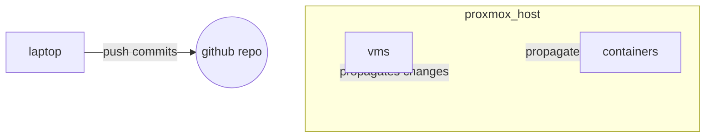
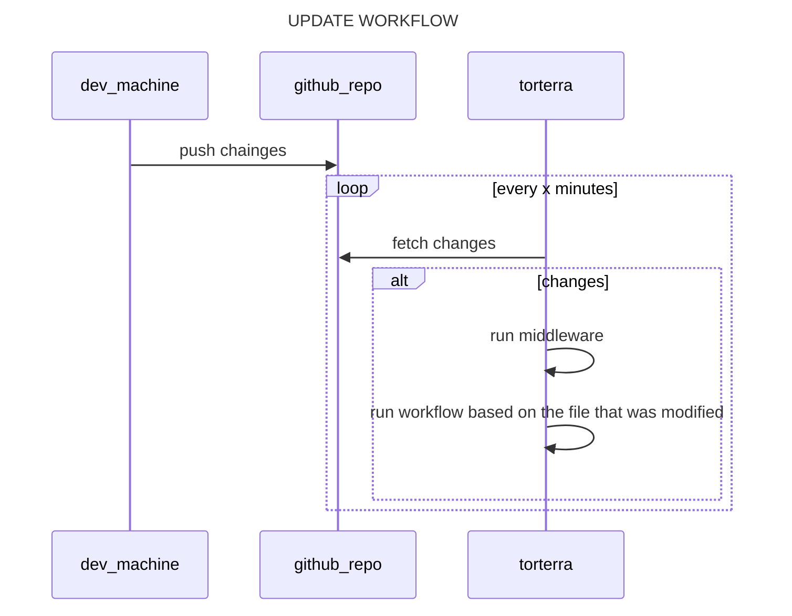
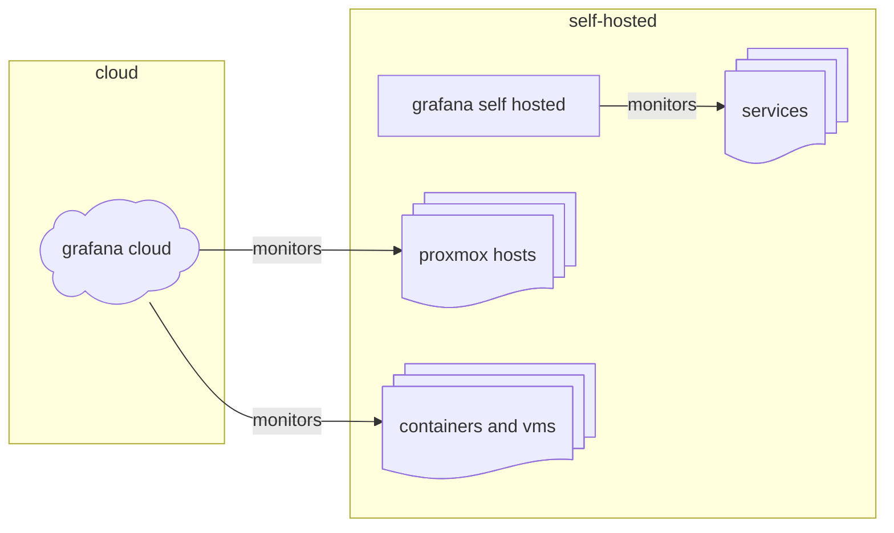
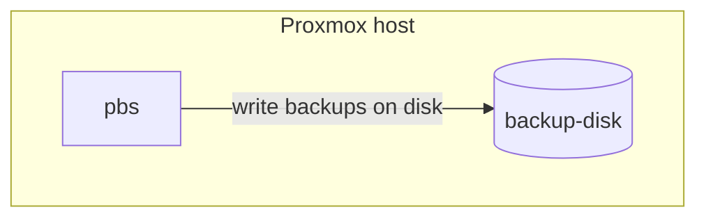
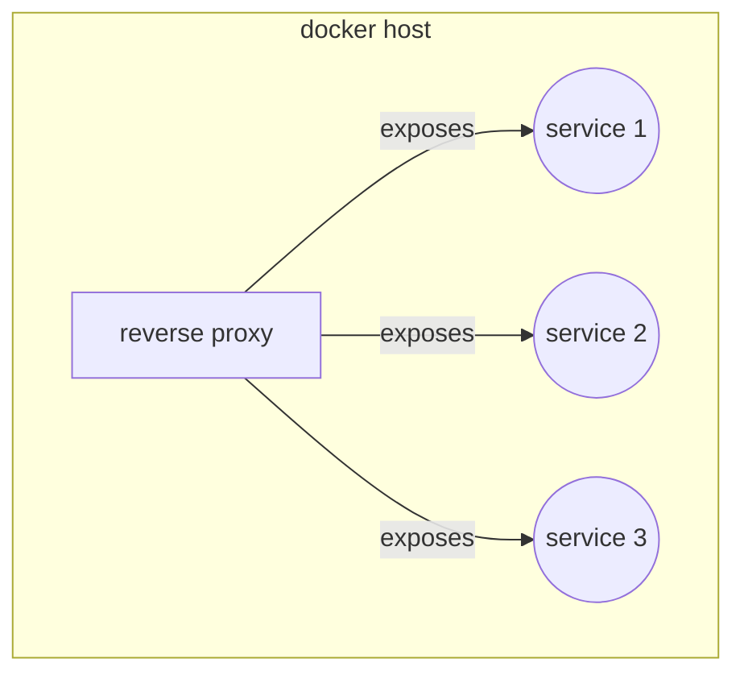

# Labcraft

Infrastructure as code for my proxmox virtual environment instance.


```mermaid
flowchart LR
A[laptop]
B((github repo))
subgraph proxmox_host
C[vms]
D[containers]
end
A -- push commits --> B ~~~ proxmox_host -- propagates changes --> C & D
```

## Why this

The goal of this project is to manage my personal proxmox instance in a git ops way with declarative infrastructure and configurations, to achieve this goal the following tech stack is deployed:

- [docker](https://www.docker.com/) to manage services for personal use
- [ansible](docs.ansible.com/ansible/latest/index.html) to automate provisioning operations
- [git](https://git-scm.com/) to version the infrastructure state
- bash scripting for utilities and workflows

## Installation

Installation of the repository is done by cloning it inside the proxmox host and making an initial setup to allow the continuous integration pipeline to trigger itself when commits are made to the main branch

- clone repository inside the proxmox host

```bash
git clone https://github.com/carnivuth/labcraft
```

- run the make target to create the vault file, then fill the file with your own secrets

```bash
make inventory/group_vars/all/vault.yml
```

- Run the make target to create the install repository

```bash
make install
```

This will create a cronjob that runs git pull every minute and a git hook to run the `install` target, also the install targets runs a set of playbook to align proxmox guests and proxmox host

### Enable automatic provisioning

Every time a commit is pushed to remote cron will pull the updates and the git hook will run the `install` target to align the proxmox cluster


```mermaid
---
title: UPDATE WORKFLOW
---
sequenceDiagram
participant dev_machine
participant github_repo
participant torterra

dev_machine ->> github_repo: push chainges
loop every x minutes
torterra ->> github_repo: fetch changes
alt changes
torterra ->> torterra: run middleware
torterra ->> torterra: run workflow based on the file that was modified
end
end
```

## Monitoring

Monitoring is done using [grafana](https://grafana.com/) (*both self hosted and cloud*) at 2 different levels:

- infrastructure level: monitors infrastructural components like proxmox hosts status, machine and vms
- service monitoring: monitors personal services information


```mermaid
flowchart LR
subgraph cloud
A@{shape: cloud, label: grafana cloud}
end
subgraph self-hosted
B@{shape: proc, label: grafana self hosted}
C@{shape: docs, label: services}
D@{shape: docs, label: proxmox hosts}
E@{shape: docs, label: containers and vms}
end
cloud ~~~ self-hosted

A -- monitors --> D & E
B -- monitors --> C
```

## Backup management

Backups are managed at the infrastructure level using [pbs](https://www.proxmox.com/en/products/proxmox-backup-server/overview) and a pool based backup job


```mermaid
flowchart
subgraph Proxmox host
    A@{shape: proc, label: pbs}
    B@{shape: db, label: backup-disk}

    A -- write backups on disk --> B
end
```

## Backup synchronization

Backups are also saved in a remote Hetzner storagebox, that is synchronized using `rsync` in a cron job

```bash
# backup rsync to storagebox and send mail with report of the sync
0 22 * * * rsync --exclude "lost+found" -Pavr --delete "/mnt/datastore" "storagebox:" >  /var/log/backup-sync-"$(date +%s)".log
```

## Docker services management

The project is used to manage my personal cloud services using `docker` containers, all services are hosted inside a vm managed trough the infrastructure layer.


```mermaid
flowchart TD
subgraph docker host
A((service 1))
B((service 2))
C((service 3))
D[reverse proxy]
end
D --exposes--> A & B & C
```

## Add a new service

Services are installed using a playbook and `docker compose` configuration file,  to add a service create a file as `service_name/docker-compose.yml` inside `services/files/` directory

### Configure web interface

To configure web interface, add the reverse proxy network as an external network

```yaml
networks:
  services:
    name: services
    external: true
```

Then add `traefik` and `homepage labels` for reverse proxy configuration and homepage icon (*replace service with the service name*)

```yaml
    labels:
      - "traefik.enable=true"
      - "traefik.http.routers.service.rule=Host(`${HOST}`)"
      - "traefik.http.services.service.loadbalancer.server.port=25600"
      - "traefik.http.routers.service.entrypoints=websecure"
      - "traefik.http.routers.service.tls=true"
      - "traefik.http.routers.service.tls.certresolver=myresolver"
      - "homepage.group=service group"
      - "homepage.name=Komga"
      - "homepage.icon=service.svg"
      - "homepage.href=https://${HOST}"
      - "homepage.description=Service description"
```

### Adding configuration files

Configuration files are managed inside the `etc/` directory and copied over when provisioning, when adding a service that needs configuration files create a dir `etc/` inside the service folder and edit the parameters as needed, see homepage service as reference
