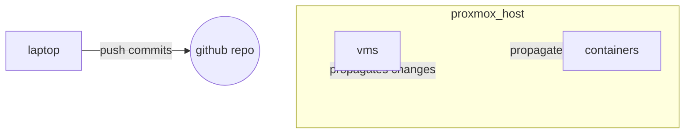
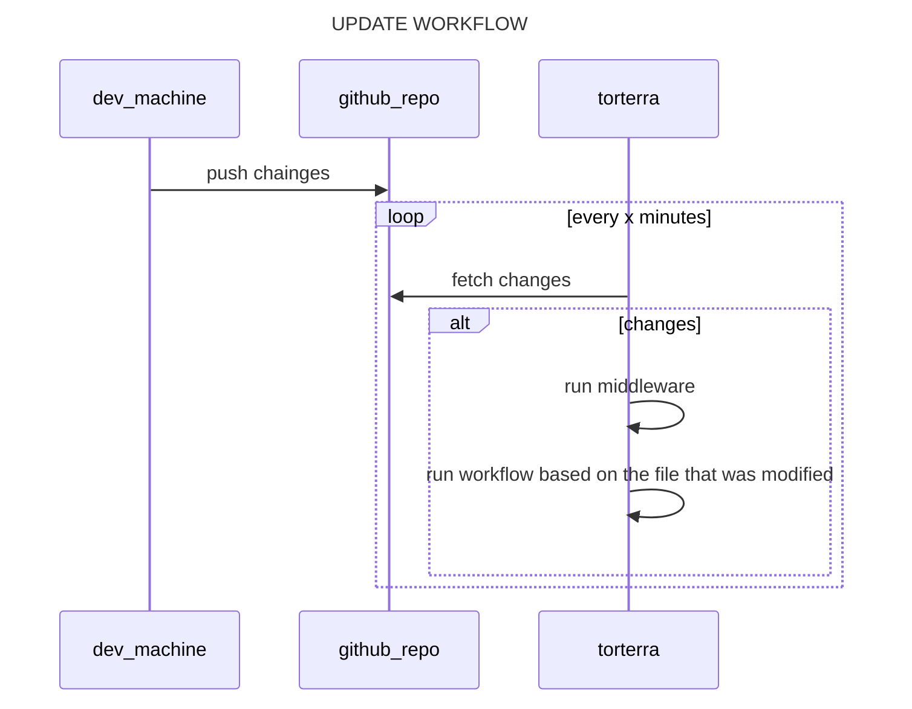

# Labcraft

Infrastructure as code for my proxmox virtual environment instance.


```mermaid
flowchart LR
A[laptop]
B((github repo))
subgraph proxmox_host
C[vms]
D[containers]
end
A -- push commits --> B ~~~ proxmox_host -- propagates changes --> C & D
```

## Why this

The goal of this project is to manage my personal proxmox instance in a git ops way with declarative infrastructure and configurations, to achieve this goal the following tech stack is deployed:

- [docker](https://www.docker.com/) to manage services for personal use
- [ansible](docs.ansible.com/ansible/latest/index.html) to automate provisioning operations
- [git](https://git-scm.com/) to version the infrastructure state
- bash scripting for utilities and workflows

## Features

- Auto provisioning of vm and containers with DNS already configured and other basic utilities
- Deployment of docker compose sets of services

## Installation

Installation of the repository is done by cloning it inside the proxmox host and making an initial setup to allow the continuous integration pipeline to trigger itself when commits are made to the main branch

- clone repository inside the proxmox host

```bash
git clone https://github.com/carnivuth/labcraft
```

- run the make target to create the vault file, then fill the file with your own secrets

```bash
make inventory/group_vars/all/vault.yml
```

- Run the make target to create the install repository

```bash
make install
```

This will create a cronjob that runs git pull every minute and a git hook to run the `install` target, also the install targets runs a set of playbook to align proxmox guests and proxmox host

### Enable automatic provisioning

Every time a commit is pushed to remote cron will pull the updates and the git hook will run the `install` target to align the proxmox cluster


```mermaid
---
title: UPDATE WORKFLOW
---
sequenceDiagram
participant dev_machine
participant github_repo
participant torterra

dev_machine ->> github_repo: push chainges
loop every x minutes
torterra ->> github_repo: fetch changes
alt changes
torterra ->> torterra: run middleware
torterra ->> torterra: run workflow based on the file that was modified
end
end
```

## Create new contariner/virtual machine

Refer to the [infrastrucure page](doc/infrastructure.md)

## Backup management

Refer to the [backup page](doc/backup.md)

## Deploy new docker services

Refer to the [new docker service deployment page](doc/docker_service.md)

