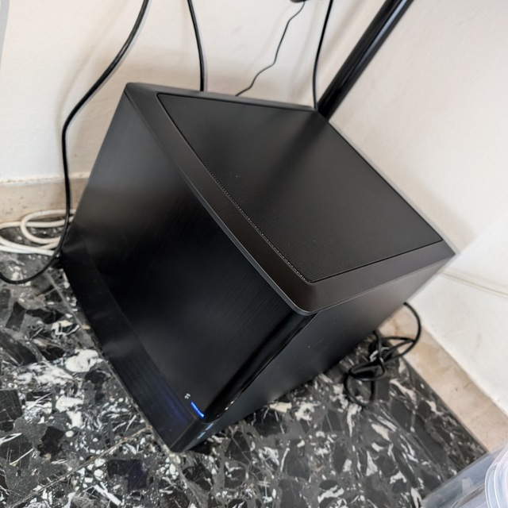
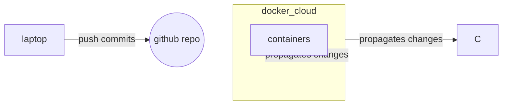
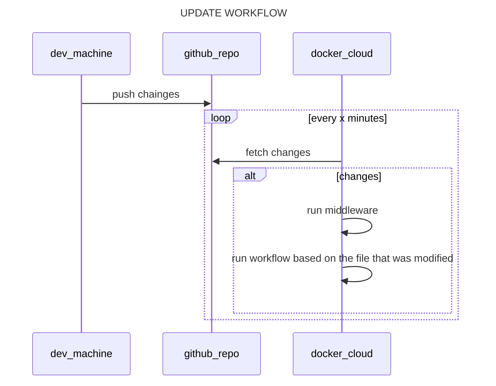
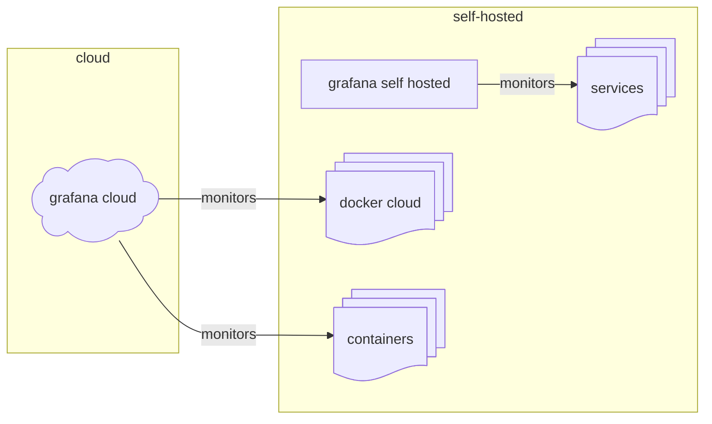
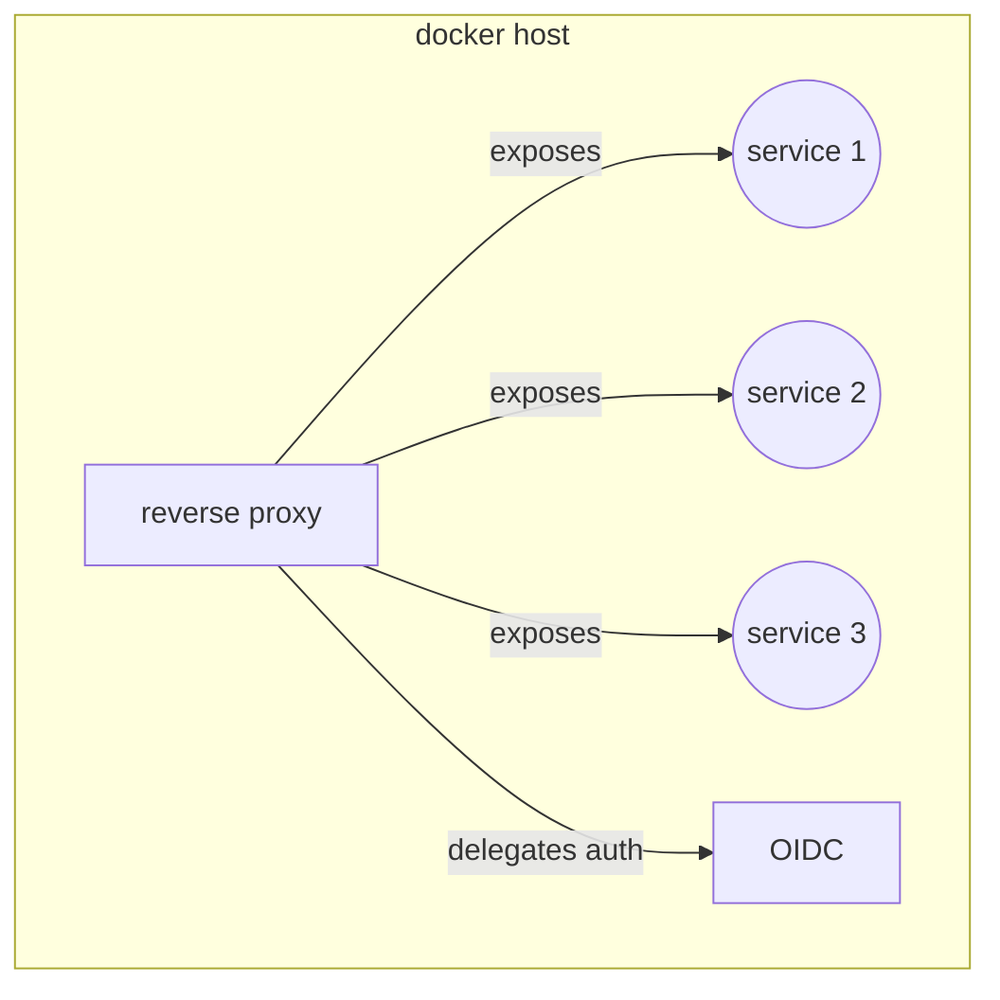

# Labcraft

Automations for my personal docker cloud


> The cloud 🙃


```mermaid
flowchart LR
A[laptop]
B((github repo))
subgraph docker_cloud
D[containers]
end
A -- push commits --> B ~~~ docker_cloud -- propagates changes --> C & D
```

## Why this

The goal of this project is to manage my personal docker cloud in a git ops way with declarative infrastructure and configurations, to achieve this goal the following tech stack is deployed:

- [docker](https://www.docker.com/) to manage services for personal use
- [ansible](docs.ansible.com/ansible/latest/index.html) to automate provisioning operations
- [git](https://git-scm.com/) to version the infrastructure state

## Installation

Installation of the repository is done by cloning it inside the docker cloud and making an initial setup to allow the continuous integration pipeline to trigger itself when commits are made to the main branch

- clone repository inside the docker cloud

```bash
git clone https://github.com/carnivuth/labcraft
```

- run the make target to create the vault file, then fill the file with your own secrets

```bash
make inventory/group_vars/all/vault.yml
```

- Run the make target to create the install repository

```bash
make install
```

This will create a cronjob that runs git pull every minute and a git hook to run the `install` target, also the install targets runs a set of playbook to align the cloud

### Automatic provisioning

Every time a commit is pushed to remote cron will pull the updates and the git hook will run the `install` target to align the cloud to the new configuration


```mermaid
---
title: UPDATE WORKFLOW
---
sequenceDiagram
participant dev_machine
participant github_repo
participant docker_cloud

dev_machine ->> github_repo: push chainges
loop every x minutes
docker_cloud ->> github_repo: fetch changes
alt changes
docker_cloud ->> docker_cloud: run middleware
docker_cloud ->> docker_cloud: run workflow based on the file that was modified
end
end
```

## Monitoring

Monitoring is done using [grafana](https://grafana.com/) (*both self hosted and cloud*):


```mermaid
flowchart LR
subgraph cloud
A@{shape: cloud, label: grafana cloud}
end
subgraph self-hosted
B@{shape: proc, label: grafana self hosted}
C@{shape: docs, label: services}
D@{shape: docs, label: docker cloud}
E@{shape: docs, label: containers}
end
cloud ~~~ self-hosted

A -- monitors --> D & E
B -- monitors --> C
```

## Docker services management

The project is used to manage my personal cloud services using `docker` containers


```mermaid
flowchart TD
subgraph docker host
A((service 1))
B((service 2))
C((service 3))
D[reverse proxy]
E[OIDC]
end
D --exposes--> A & B & C
D -- delegates auth --> E
```

## Add a new service

Services are installed using a playbook and `docker compose` configuration file,  to add a service run the following make target

```bash
SERVICE_NAME=my service
make playbooks/roles/align_services/$SERVICE_NAME
```

### Configure web interface

To configure web interface, add the service network

```yaml
networks:
  services:
    name: services
    external: true
```

Then add `traefik` and `homepage labels` for reverse proxy configuration and homepage icon (*replace service with the service name*)

```yaml
    labels:
      - "traefik.enable=true"
      - "traefik.http.routers.service.rule=Host(`${HOST}`)"
      - "traefik.http.services.service.loadbalancer.server.port=25600"
      - "traefik.http.routers.service.entrypoints=websecure"
      - "traefik.http.routers.service.tls=true"
      - "traefik.http.routers.service.tls.certresolver=myresolver"
      - "homepage.group=service group"
      - "homepage.name=Komga"
      - "homepage.icon=service.svg"
      - "homepage.href=https://${HOST}"
      - "homepage.description=Service description"
```

### Adding env variables

Environment variables can be added in the `playbooks/roles/align_services/files/$SERVICE_NAME/env.j2`

### Adding configuration files

Configuration files are managed inside the `etc/` directory and copied over when provisioning, when adding a service that needs configuration files create a dir `etc/` inside the service folder and edit the parameters as needed, see homepage service as reference
